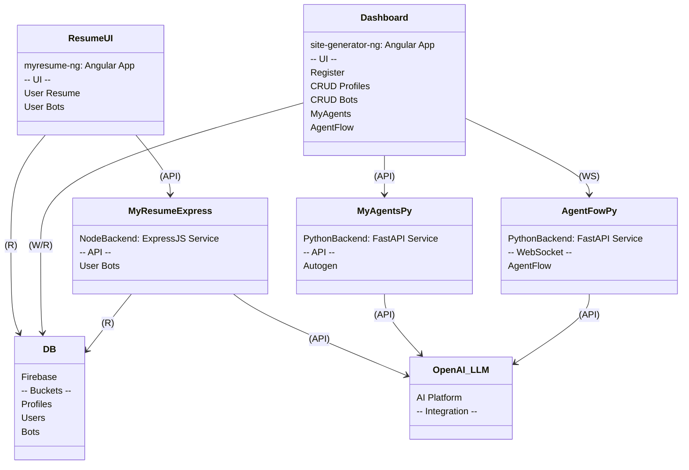

[](https://github.com/thaer899/connectorzzz/actions/workflows/myresume-ng.yml)
[](https://github.com/thaer899/connectorzzz/actions/workflows/site-generator-ng.yml)
[](https://github.com/thaer899/connectorzzz/actions/workflows/myresume-ai-automate.yml)

### Connectorzzz Project

This repository serves as the nucleus of an ensemble of projects and utilities.
Engineered with precision for crafting and deploying top-notch applications.
https://log-book-ng.web.app/
The project is exposed across multiple domains and subdomains:

- 🌎 Resume UI: [`log-book-ng.web.app`](https://log-book-ng.web.app)
- 🛠️ Dashboard: [`connectorzzz.com`](https://connectorzzz.com)

The architecture is methodically structured.
Facilitating a streamlined workflow for managing the diverse project facets.
Encompassing backend services, front-end applications, and adept cloud resource orchestration.

#

### Diagram:



#

---

<details>
<summary>📂 Project Highlights</summary>

- **Summary**: Intelligent solutions.
- **Backend**: Backend services to interact with database and enhance UIs.
- **Frontend**: Front-end using angular applications for a resume exposure.
- **Admin Console**: Administrative console configurable using angular for UI and BOT management and orchestration.
- **AI**: A suite of tools and components to interact with AI models.
- **Utils**: A suite of tools for automating and streamlining various aspects of the project.
- **CI/CD**: Automation pipelines for all aspects of the project.
</details>

---

### Workflows:

🔄 [myresume-ai-automate ](https://github.com/thaer899/connectorzzz/tree/master/.github/workflows/myresume-ai-automate): Build, deploy, and test Microservices hosted in GCP Kubernetes.

🔄 [myresume-ng ](https://github.com/thaer899/connectorzzz/tree/master/.github/workflows/myresume-ng): Build, deploy, and test MyResumeNG website hosted in Firebase Hosting.

🔄 [site-generator-ng ](https://github.com/thaer899/connectorzzz/tree/master/.github/workflows/site-generator-ng): Build, deploy, and test SiteGeneratorNG website hosted in Firebase Hosting.

---

### Apps:

🖥️ [myresume-ng ](https://github.com/thaer899/connectorzzz/tree/master/myresume-ng):
Angular-based application showcasing my professional journey and skill set.

🌐 [site-generator-ng ](https://github.com/thaer899/connectorzzz/tree/master/site-generator-ng):
A dynamic site generator engineered with Angular, facilitating seamless site creation and management.

🧠 [myresume-ai ](https://github.com/thaer899/connectorzzz/tree/master/myresume-ai):
A suite of tools and components to interact with Kubernetes cluster and AI models.

🛠️ [myresume-express ](https://github.com/thaer899/connectorzzz/tree/master/myresume-express):
ExpressJS powered backend service, designed to deliver robust support for my online resume portal.

🛠️ [agentflow-py ](https://github.com/thaer899/connectorzzz/tree/master/agentflow-py):
FastAPI powered backend service, designed to deliver websocket connection between OpenAI LLMs and the dashboard.

🛠️ [myagents-py ](https://github.com/thaer899/connectorzzz/tree/master/myagents-py):
FastAPI powered backend service, designed to deliver chat solution using Autogen.

🧰 [myresume-utils ](https://github.com/thaer899/connectorzzz/tree/master/myresume-utils):
A collection of utility tools and libraries enhancing development and operational efficiencies.

#

### Project Structure

```plaintext
\---connectorzzz
    +---.github
    |   \---workflows
    +---myresume-ai
    |   \---src
```

### Running the project

```bash
Install "Auto Run Command" extension in VSCode
```
